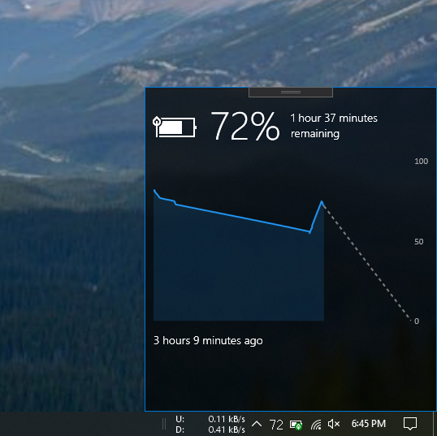

# Battery Monitor (Unreleased)

My first C# application. A system tray battery monitor that shows the percentage instead of a battery symbol. Future plans include command line triggers for various percentages (e.g: run a program when the battery percentage reaches 42%).

**Features:**
* [x] Percentage icon in system tray area
* [x] Tooltip with battery percentage
* [x] Graph showing battery drain in the current charge cycle
* [x] Light/Dark mode depending on the system theme
* [ ] Battery saver toggle
* [ ] Settings for the colour of the system tray icon depending on charge percentage
* [ ] Trigger programs and commands at certain percentages

Beta Snapshot (in development):

